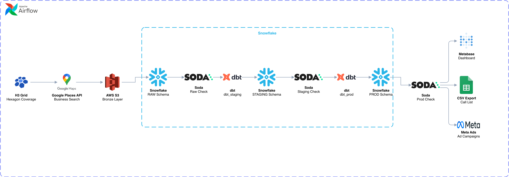

# Swacchh B2B Leads Pipeline

A production data engineering pipeline that generates a daily, phone-ready B2B lead list for a Hyderabad-based food ingredients manufacturer — replacing third-party lead generation vendors with a fully automated, self-refreshing outbound system.

---

## Problem

Swacchh Food Products sells ginger garlic paste, oils, and spices to restaurants, caterers, and grocery stores across Hyderabad. Their sales team relied on paid third-party lead vendors — expensive, low-coverage, and often stale.

Most restaurants already have a supplier and never search for a new one. Inbound discovery doesn't work. The only way to reach them is outbound — which requires a constantly updated, accurate contact database.

---

## Solution

A daily Airflow pipeline that:

1. Tiles Hyderabad with an **H3 hexagonal grid** and queries the **Google Places API** for every hexagon
2. Stores raw results in **AWS S3** and loads them into **Snowflake** with deduplication
3. Transforms and validates data through **dbt** models and **Soda Core** quality checks
4. Exports a **priority-ranked call list** to S3 daily — sorted HIGH → MEDIUM → LOW so the sales team always calls the highest-value leads first

**Result:** outreach scaled from 5–10 leads/month to 4–6 leads/day, eliminating $350/month in vendor spend.

---

## Architecture



---

## Tech Stack

| Layer | Tool |
|---|---|
| Orchestration | Apache Airflow (Astro Runtime) |
| Coordinate grid | Uber H3 — resolution 8 |
| Data source | Google Places API (New) |
| Raw storage | AWS S3 |
| Warehouse | Snowflake |
| Transformation | dbt-core + astronomer-cosmos |
| Data quality | Soda Core |
| Dashboard | Metabase |

---

## Key Design Decisions

**H3 hexagonal grid over a square grid**
Hexagons are equidistant in all 6 directions, which eliminates the corner-distance problem in square grids. Each resolution-8 cell pairs precisely with the Places API's 500m search radius — no gaps, minimal overlap, and ~13% fewer API calls than an equivalent square grid.

**S3 as an idempotent checkpoint**
Each hexagon's raw data is written to S3 as an immutable file. On every run, the pipeline skips hexagons that already have all four business-type files in S3. This means a mid-run failure is safe — completed hexagons stay intact and only the failed ones retry on the next run. No separate tracking table needed.

**Airflow dynamic task mapping**
One Airflow task is created per hexagon at runtime and all run in parallel — each with independent logs, retries, and state. The pipeline scales to any geography (370,000 hexagons for all of Telangana + AP) without any code changes.

**Bulk load + MERGE over row-by-row INSERT**
Snowflake reads JSON files directly from S3 via an IAM storage integration — no data passes through Airflow memory. A MERGE on `place_id` deduplicates across overlapping hexagon boundaries and makes every daily run fully idempotent.

**No credentials in SQL or logs**
Snowflake accesses S3 through an IAM trust policy and storage integration. Credentials never appear in SQL strings, Airflow task logs, or environment variables at query time.

**Priority scoring**
Leads are scored HIGH / MEDIUM / LOW using Google rating and review count as a footfall proxy. Thresholds are set from the data distribution (not hardcoded guesses), so the daily call list is always sorted by estimated order potential.

---

## Project Structure

```
dags/
  leads_pipeline.py               — DAG definition

include/
  coordinates/
    generator.py                  — H3 grid generator
  places/
    tasks.py                      — Google Places API fetch + S3 upload
  snowflake/
    tasks.py                      — Bulk load from S3, deduplicate into RAW
  export/
    tasks.py                      — CSV export to S3, sorted by priority tier
  soda/
    helpers.py                    — Soda scan runner
    checks/
      raw_places.yml              — DQ checks after load (RAW schema)
      stg_places.yml              — DQ checks after staging transform
      leads.yml                   — DQ checks on final leads table
  dbt/swacchh/
    dbt_project.yml               — staging=view, prod=table
    cosmos_config.py              — Cosmos + Snowflake profile config
    macros/
      generate_schema_name.sql    — schema routing for Cosmos
    models/
      sources/sources.yml         — RAW source declaration
      staging/stg_places.sql      — clean and type raw JSON
      prod/leads.sql              — filter, score, and rank leads
      prod/leads_by_area.sql      — aggregated view by area + business type
      prod/coverage_stats.sql     — pipeline health metrics

docker-compose.override.yml       — Metabase service on localhost:3000
architecture.png                  — pipeline architecture diagram
.env.example                      — environment variable template
```

---

## Setup

### Prerequisites

- [Astro CLI](https://www.astronomer.io/docs/astro/cli/install-cli) + Docker
- Google Cloud project with **Places API (New)** enabled
- AWS account with an S3 bucket
- Snowflake account

### 1. Clone and configure

```bash
git clone https://github.com/manojb01/b2b-leads-pipeline.git
cd b2b-leads-pipeline
cp .env.example .env
# Fill in your values
```

### 2. Set up Snowflake

Run as `ACCOUNTADMIN` to create the role, user, warehouse, and database:

```sql
CREATE ROLE AIRFLOW_ROLE;
CREATE USER AIRFLOW_USER PASSWORD='<your-password>' DEFAULT_ROLE=AIRFLOW_ROLE;
GRANT ROLE AIRFLOW_ROLE TO USER AIRFLOW_USER;

CREATE WAREHOUSE AIRFLOW_WAREHOUSE
  WAREHOUSE_SIZE = XSMALL AUTO_SUSPEND = 60 AUTO_RESUME = TRUE;
GRANT USAGE ON WAREHOUSE AIRFLOW_WAREHOUSE TO ROLE AIRFLOW_ROLE;

CREATE DATABASE SWACCHH_LEADS;
GRANT ALL ON DATABASE SWACCHH_LEADS TO ROLE AIRFLOW_ROLE;
```

For S3 access from Snowflake without credentials in SQL, follow the [Snowflake Storage Integration guide](https://docs.snowflake.com/en/user-guide/data-load-s3-config-storage-integration).

### 3. Start Airflow

```bash
astro dev start
```

Airflow UI → [http://localhost:8080](http://localhost:8080) · username: `admin` · password: `admin`

### 4. Add Airflow connections

Go to **Admin → Connections** and add:

| Conn ID | Type | Details |
|---|---|---|
| `google_places_api` | HTTP | Host: `https://places.googleapis.com`, Password: your API key |
| `aws_s3` | Amazon Web Services | Login: access key ID, Password: secret access key |
| `snowflake_default` | Snowflake | Account, login, password, role, warehouse, database |

### 5. (Optional) Metabase dashboard

```bash
docker compose -f docker-compose.override.yml up metabase
```

Metabase → [http://localhost:3000](http://localhost:3000). Connect it to the Snowflake PROD schema to explore leads by area, business type, and priority tier.

---

## DAG Flow

```
is_api_available          — HTTP sensor, confirms Places API is reachable
        ↓
get_unprocessed_coords    — skips hexagons already fetched today
        ↓
fetch_and_save            — [dynamically mapped] one task per hexagon, all parallel
        ↓
flatten_s3_keys
        ↓
load_to_snowflake         — bulk load from S3 → deduplicate into RAW
        ↓
soda_check_raw            — validate raw data before transformation
        ↓
dbt_staging               — clean and type raw JSON into STG_PLACES
        ↓
soda_check_staging        — validate staging data before scoring
        ↓
dbt_prod                  — score and rank leads into LEADS table
        ↓
soda_check_leads          — validate final leads before export
        ↓
export_leads_csv          — write ranked call list to S3
```
